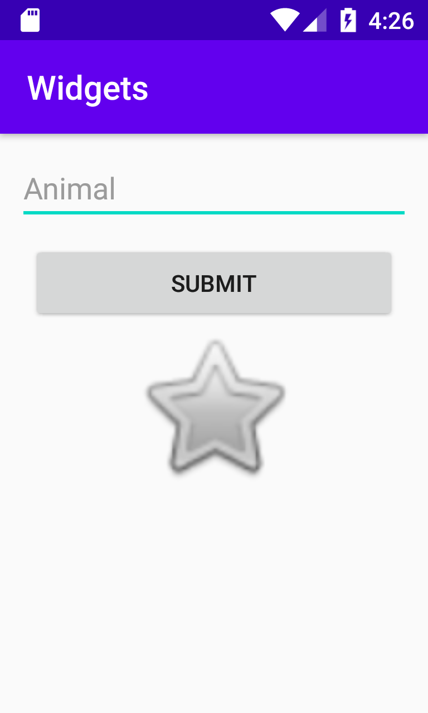

# Rapport
Tre stycken olika widgets har lagts till i en *LinearLayout*, dessa är:

 1. EditText
 2. Button
 3. ImageView

## EditText
Denna widget tillåter inmatning av text, och lagdes på toppen i layouten genom att ange den först  i **activity_main.xml** . Även en margin har lagt till och en "hint" som visar en grå text som kort föklarar vilken typ av inehåll som ska synas.

    <EditText
      android:id="@+id/new_text_edit"
      android:layout_width="match_parent"
      android:layout_height="wrap_content"
      android:layout_margin="10dp"
      android:hint="@string/animal"
      android:inputType="text" />
## Button
Denna widget lägger helt enkelt till en tryckbar knapp. Knappaen har lagts i mitten / center av layouten med `layout _gravity`, men har för övrigt inte ändrats. Den har ingen speciell funktion för detta programmet.

    <Button
      android:id="@+id/new_button"
      android:layout_width="220dp"
      android:layout_height="wrap_content"
      android:layout_gravity="center"
      android:text="@string/submit" />
## ImageView
Denna widget lägger till en bild, i detta fallet "btn_star" via `@android:drawable` som refererar till bilden. För att använda bilden behövdes dock `vectorDrawables.useSupportLibrary = true`i **build.gradle** för att tillåta användningen av bilder. Även bilden har lagts i mitten av skärmen här då det passar in bättre.

    <ImageView
      android:id="@+id/new_image_view"
      android:layout_width="172dp"
      android:layout_height="100dp"
      android:layout_gravity="center"
      android:contentDescription="@string/content_des"
      android:padding="0dp"
      app:layout_constraintBottom_toBottomOf="parent"
      app:layout_constraintEnd_toEndOf="parent"
      app:layout_constraintStart_toStartOf="parent"
      app:layout_constraintTop_toTopOf="parent"
      app:srcCompat="@android:drawable/btn_star" />
## Strings
Inom **string.xml** lagdes kod till som hänvas av alla element som använder någon form av textt. Tillexempel använder sig hinten på *EditText* `android:hint="@string/animal"`. Detta hänvisar till samma strings variabel i xml filen.

    <resources>
	 <string name="app_name">Widgets</string>
	 <string name="animal">Animal</string>
	 <string name="submit">Submit</string>
	 <string name="content_des">Picture</string>
	</resources>

## Screenshot
